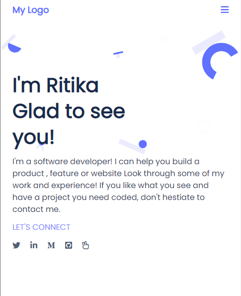

<h1>Portfolio</h1>

# 📗 Table of Contents

- [📖 About the Project](#about-project)
  - [🛠 Built With](#built-with)
  - [🚀 Live Demo](#live-demo)
- [💻 Getting Started](#getting-started)
- [👥 Authors](#authors)
- [🔭 Future Features](#future-features)
- [🤝 Contributing](#contributing)
- [⭐️ Show your support](#support)
- [🙏 Acknowledgements](#acknowledgements)
- [❓ FAQ](#faq)
- [📝 License](#license)

# 📖 [Protofilio] 
**[Protofilio]** everything you want to know about me!

# Project Screenshot image

## Built With

- HTML
- CSS
- JavaScript 

## 🚀 Live Demo 

- [Live_Demo](https://ritikarawat220.github.io/My-Portfolio/)

(<a href="#readme-top">back to top</a>)

## Getting Started

- Create a local directory that you want to clone the repository.

- Open the command prompt in the created directory.

- On the terminal run this command git clone https://github.com/ritikarawat220/My-Portfolio.git

- Go to the repository folder using command prompt cd.

- Install the dev dependencies for linters run npm install.

## 👥 Authors 

👤 **Ritika Rawat**

- GitHub: [ritikarawat220](https://github.com/ritikarawat220)
- Twitter: [@ritikarawat22](https://twitter.com/Ritikarawat22)
- LinkedIn: [LinkedIn](https://www.linkedin.com/in/rawatritika/)

## 🔭 Future Features 

- [ ] **Improve page elements**
- [ ] **will improve styles and add more pages**
- [ ] **will add Java script**

(<a href="#readme-top">back to top</a>)

## 🤝 Contributing 

Contributions, issues, and feature requests are welcome!

Feel free to check the [issues page](../../issues/).

(<a href="#readme-top">back to top</a>)

## ⭐️ Show your support 

If you like this project give me star!

(<a href="#readme-top">back to top</a>)

## 🙏 Acknowledgments 

- You can do it
- You need patience and smart friend who can help you.

(<a href="#readme-top">back to top</a>)

## ❓ FAQ 

## 📝 License 

This project is [MIT](./MIT.md) licensed.

(<a href="#readme-top">back to top</a>)

